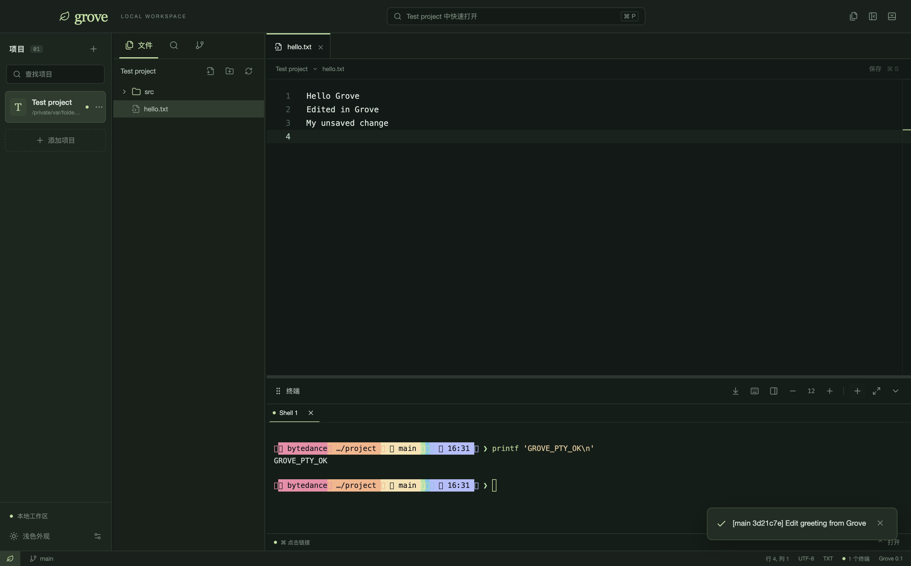

# Grove

一个面向 macOS 的轻量代码编辑器。集中管理本地项目，在同一个窗口里编辑文件、运行 Agent CLI、查看 Git Diff 并提交。



## 开始使用

从 [GitHub Releases](https://github.com/lyuke/grove/releases/tag/v0.1.4) 下载对应架构的 DMG，将 Grove 拖到 Applications 后启动。本地构建的安装包位于 `release/0.1.4/`。

- Apple Silicon：`Grove-0.1.4-arm64.dmg`
- Intel：`Grove-0.1.4-x64.dmg`

当前为试用构建，未使用 Apple Developer ID 签名或公证。

系统要求：macOS 12 或更新版本。

点击「添加项目」选择本地目录，然后在文件树打开文件。底部「新建终端」会在该项目目录启动登录 Shell，可以运行 `codex`、`claude` 或其他已安装的 CLI。

Git 操作使用本机 Git。Git 身份、签名配置和提交钩子沿用你的仓库设置；需要交互认证或签名时可以在终端执行提交。搜索程序 ripgrep 已随安装包附带。

构建与测试详情见 [VERIFY.md](VERIFY.md)，性能对比见 [PERFORMANCE.md](PERFORMANCE.md)。

## 第一版能力

- 项目添加、查找、排序、修改显示名称、重新定位和移除。
- 可折叠、调整宽度的项目栏和文件侧栏；终端支持下方/右侧停靠、拖动边缘调整大小、最大化及还原。
- 按需展开文件树，创建文件/目录、重命名、移动和移到废纸篓。
- Monaco 多标签编辑、语法高亮、文件内查找替换、保存和行列位置恢复。
- 文件名快速打开、项目全文搜索。
- 磁盘变化监听；未保存内容与外部修改冲突时，比较并明确选择版本。
- 项目独立的多个 PTY 终端；切换项目不中断任务。
- 终端工具栏支持字体缩小/放大（9–24 px），点击字号重置为 12 px；停靠位置、宽高、最大化状态与字号自动保存。
- 终端标题可拖到编辑区右侧或下方；工具栏也可切换停靠位置，任务持续运行。
- 终端支持自定义快捷键、滚动到底部按钮，以及 ⌘ 点击 HTTP/HTTPS 链接在默认浏览器打开。
- Git 分支、工作区和暂存区列表、并排/行内 Diff、暂存、取消暂存、提交。Diff 复用编辑器并折叠未修改区域，大文件使用纯文本模式。
- 深浅主题、macOS 菜单与快捷键。

移除项目只移除列表记录。删除文件会先确认，再移入 macOS 废纸篓。关闭含未保存内容的标签、关闭终端和退出应用均有对应提示。退出时可选择保存所有文件或明确放弃修改；保存失败会保持应用打开。退出前会写入最新工作区布局。

## 常用快捷键

| 快捷键   | 操作                                 |
| -------- | ------------------------------------ |
| `⌘ O`    | 添加本地项目                         |
| `⌘ P`    | 按文件名快速打开                     |
| `⌘ S`    | 保存当前文件                         |
| `⌘ ⌥ S`  | 全部保存（包括其他项目的已打开文件） |
| `⌘ W`    | 关闭当前标签                         |
| `⌘ F`    | 编辑器内查找；查找框可展开替换       |
| `⌘ ⇧ F`  | 搜索项目内容                         |
| `⌘ B`    | 切换文件侧栏                         |
| `⌃ \``   | 切换终端面板                         |
| `⌃ ⇧ \`` | 新建终端                             |

终端默认快捷键为 Control + 反引号。没有运行中的终端时会创建终端；在编辑器中按下会显示并聚焦终端，在终端中再次按下会收起。点击终端工具栏的快捷键设置按钮或底部快捷键文字，可输入 `Command+J`、`Control+Alt+T` 等组合；设置立即生效并自动保存。

## 本地开发

建议使用 Node.js 22 或 24 及 npm。首次安装和准备资源需要联网。

```sh
npm ci --legacy-peer-deps
npm run dev
```

开发模式会构建主进程和 preload，启动 Vite 与 Electron。修改 React 界面会热更新；修改 `electron/` 中的代码需要重启开发进程。

```sh
npm run build          # TypeScript 检查、打包界面与 Electron
npm start              # 运行已构建的桌面应用
npm test               # 真实文件系统 / Git 仓库测试
npm run test:e2e       # 启动 Electron 完整流程测试
npm run package        # 生成 arm64 和 x64 DMG
```

也可以单独执行 `npm run package:arm64` 或 `npm run package:x64`。

测试隔离在临时项目和临时应用数据目录中，不使用你的日常项目。端到端测试生成的界面截图位于 `artifacts/`。

验证打包后的应用：

```sh
GROVE_EXECUTABLE="$PWD/release/0.1.4/mac-arm64/Grove.app/Contents/MacOS/Grove" npm run test:packaged
GROVE_EXECUTABLE="$PWD/release/0.1.4/mac/Grove.app/Contents/MacOS/Grove" npm run test:packaged
```

在 Apple Silicon 上运行 x64 版本需要 Rosetta；转译测试不能代替 Intel 实机测试。

## 项目结构

```text
electron/
  main.ts               窗口、菜单、IPC、终端、项目配置与目录监听
  preload.ts            明确列举的系统能力接口
  services.ts           文件、路径校验、Git、搜索
shared/types.ts         主进程和界面共享类型
src/
  App.tsx               工作区状态与交互编排
  components/           文件树、编辑器、Diff、Git、搜索、终端
  styles.css            界面布局与样式
  tokens.css            深浅主题色值
scripts/                开发、构建、原生组件与资源准备
tests/                  系统测试和 Electron 端到端测试
resources/              应用图标与两种架构的搜索程序
PLAN.md                 产品范围与阶段验收要求
```

## 数据与实现边界

- 项目列表、主题、布局、标签和光标位置保存在应用 `userData` 目录下的 `workspace.json`。当前构建使用 `~/Library/Application Support/grove/`。
- 未保存内容保留在内存中。退出前需要保存；第一版没有崩溃草稿恢复。
- 终端在切换项目时保留，应用退出后不恢复原进程。
- 文本编辑支持有效 UTF-8 文件，单文件最大 5 MB；二进制文件不提供文本编辑。
- 搜索结果最多显示 200 条；默认尊重 Git ignore，并排除依赖和构建目录。全文搜索跳过大于 1 MB 的文件。
- 文件系统监听默认排除 `node_modules`、`dist`、`build`、`vendor` 和 Git 对象目录。
- Git 提交只提交已暂存内容。打开仓库子目录时，如果仓库其他目录还有暂存文件，会要求改为打开仓库根目录，以便确认完整提交范围。
- 第一版没有独立 Agent 对话、完整跨文件语言服务、插件系统、调试器或远程开发。

## 技术参考

- [Electron Context Isolation](https://www.electronjs.org/docs/latest/tutorial/context-isolation)
- [Electron IPC](https://www.electronjs.org/docs/latest/tutorial/ipc)
- [Monaco Editor](https://github.com/microsoft/monaco-editor)
- [node-pty](https://github.com/microsoft/node-pty)
- [ripgrep 15.2.0](https://github.com/BurntSushi/ripgrep/releases/tag/15.2.0)：资源脚本使用固定版本及官方 SHA-256 校验和，安装包附带其许可文件。
